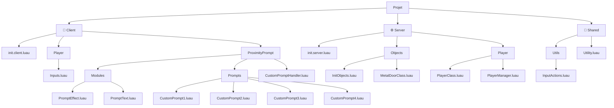
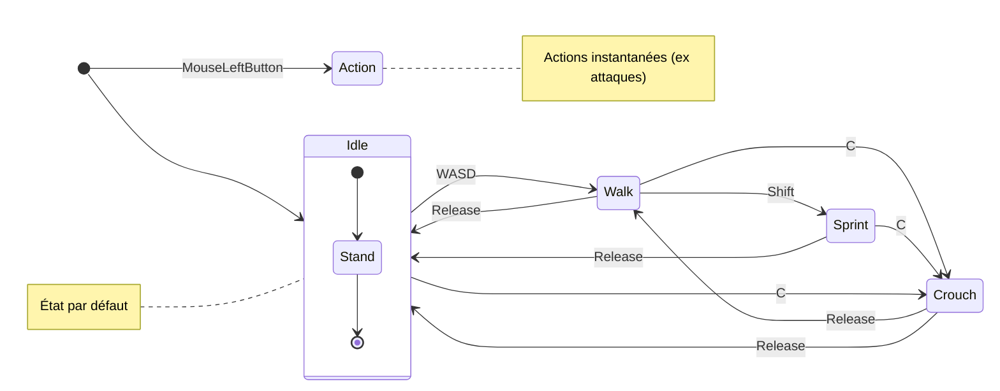
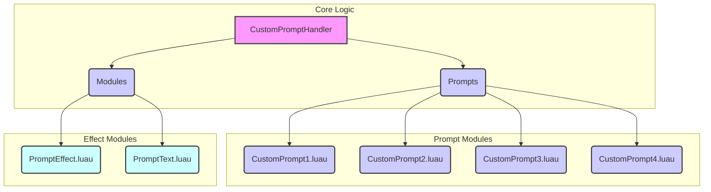

# 🧩 Fiche technique — _Lost Signal DEMO_

## 🎮 **Composantes de gameplay**

| Composante          | Description                                                      | Implémentation                                |
| ------------------- | ---------------------------------------------------------------- | --------------------------------------------- |
| Déplacement de base | Mouvement standard Roblox `Humanoid`                             | Par défaut                                    |
| Accroupissement     | Toggle ou maintient (`ctrl` ou `C`) pour passer en mode accroupi | Animation + vitesse réduite                   |
| Sprint              | Sprint temporaire avec barre de stamina                          | `Shift` + système de stamina et effets visuel |
| Stamina             | Barre qui diminue en sprint, se recharge lentement               | UI + logique de cooldown                      |
| Lampe torche        | Toggle avec `F`, portée limitée, effet de lumière dynamique      | `SpotLight` attaché au joueur                 |
| Interaction         | Appuie sur une touche `E` pour interagir avec des objets         | `ProximityPrompt`                             |
| Journal/Logs        | Objets à ramasser ou lire                                        | UI                                            |
| Effets visuels      | Brouillard, lumières dynamiques, distorsion visuelle             | `PostEffect`, `Tween`, `ParticleEmitter`      |
| Effets sonores      | Bruits de pas, radio, ambiance et jumpscare                      | `SoundService` + `Sound` localisés            |
| Evènements scriptés | Apparitions, blackout, portes qui s'ouvrent toutes seules        | `BindableEvent`, `Tween`, `Animation`         |
| Fin de partie       | Déclenchement d'une fin (sortie, piégeage, révélation)           | Trigger + UI narrative                        |

## 🧱 **Structure technique du projet**

### 👤Client

- `Player/Inputs.luau`: 
	- Binding des touches
- `ProximityPrompt/Modules/PromptEffect.luau`: 
	- Gère la création et la suppression des effets des `ProximityPrompt`
- `ProximityPrompt/Modules/PromptText.luau`: 
	- Gère le visuel du texte afficher en fonction du binding
- `ProximityPrompt/Prompts/CustomPrompt1.luau`:
	- Module de démo pour créer un visuel
- `ProximityPrompt/Prompts/CustomPrompt2`:
	- Module de création de visuel pour `ProximityPrompt`
- `ProximityPrompt/Prompts/CustomPrompt3.luau`:
	- Pareille mais utilise un autre UI
- `ProximityPrompt/Prompts/CustomPrompt4.luau`:
	- Pareille mais utilise un `SurfaceGui`
- `ProximityPrompt/CustomPromptHandler.luau`:
	- Gère l'apparition du `ProximityPrompt` en fonction des paramètres qu'il contient
- `init.client.luau`:
	- Appelle les modules pour les initialiser

### ⚙️Server

- `Objects/InitObjects.luau`:
	- Appelle les objets créés et les initialise
- `Objects/MetalDoorClass.luau`:
	- Classe pour les portes en métal
- `Player/PlayerClass.luau`:
	- Classe pour les joueur
- `Player/PlayerManager.luau`:
	- Gère les joueurs et les appels
- `init.server.luau`:
	-  Gère la connexion des joueurs et du serveur

### 🔁 Shared

- `Utils/InputActions.luau`:
	- Module très puissant utilisant le nouveau type de binding
- `Utility.luau`:
	- Bibliothèque perso de fonctions très pratiques

## State Machine

## 🚀 ProximityPrompt : Un système de prompts personnalisables

Ce projet propose une approche flexible pour gérer et afficher des prompts interactifs dans votre jeu, offrant des options de personnalisation avancées pour le visuel et le comportement.

Projet réalisé en partie par **@Madrian622** lien de son [discord](https://discord.gg/aGmEVsmq7V)  de plus il y a une vidéo expliquant en partie comment fonctionne son système (ce qui m'arrange) [vidéo](https://youtu.be/CHYY0c4SE98)
### 🏗️ Architecture

Le système est conçu de manière modulaire, facilitant l'ajout de nouveaux types de prompts et d'effets.

_Cliquez sur les éléments du diagramme pour naviguer vers la section "Logic"._

### 🧠 Logique des Composants

Chaque module a une responsabilité claire au sein du système.

- `CustomPromptHandler.luau`
    - **Rôle :** Le cœur du système. Il maintient le service des prompts, gère leur affichage et leur tri en fonction de la proximité et des configurations.
- `PromptEffect.luau`
    - **Rôle :** S'occupe de la création et de la gestion des effets visuels secondaires, tels que les `Beam` ou `Highlight`, qui accompagnent les prompts.
- `PromptText.luau`
    - **Rôle :** Gère l'affichage dynamique de l'ActionText et de l'ObjectText. (Note: Ce module peut être simplifié ou retiré si ces fonctionnalités ne sont pas utilisées.)
- `CustomPrompt1.luau`
    - **Description :** Un module de démonstration simple pour illustrer les bases d'un prompt personnalisé.
- `CustomPrompt2.luau`
    - **Description :** Module de prompt optimisé pour un affichage via un `BillboardGui` flottant au-dessus de l'objet.
- `CustomPrompt3.luau`
    - **Description :** Similaire au CustomPrompt2, mais intégrant des effets visuels et/ou sonores différents pour une expérience utilisateur variée.
- `CustomPrompt4.luau`
    - **Description :** Module de `prompt` conçu pour s'intégrer à un `SurfaceGui`, idéal pour les interactions directes sur la surface d'un objet. (C'est le module actuellement utilisé dans le jeu principal.)

### ⚙️ Mise en Place d'un ProximityPrompt Personnalisé

Pour implémenter votre ProximityPrompt personnalisé, suivez ces étapes de configuration :

1. **Ajoutez une `Configuration`**
    
    - Insérez une instance de `Configuration` dans l'objet où se trouve votre `ProximityPrompt` et nommez-la '**CustomPromptConf**'.
2. **Configurez les Options (valeurs booléennes et leurs sous-paramètres)**
    
    - À l'intérieur de '**CustomPromptConf**', vous pouvez ajouter des `BoolValue` pour activer différentes fonctionnalités. Pour chaque `BoolValue`, des paramètres spécifiques peuvent être définis :
        
        - **`BoolValue` nommé `Beam`**
            
            - Active un effet de `Beam` émanant de l'objet.
            - **Paramètres disponibles (exemples non exhaustifs) :**
                - **BeamColor**: `Color3Value` (Couleur du faisceau)
                - **BeamTexture**: `StringValue` (ID de l'asset de texture du faisceau)
                - **BeamTransparency**: `NumberValue` (Transparence du faisceau, de 0 à 1)
                - **BeamWidth**: `NumberValue` (Largeur du faisceau)
        - **`BoolValue` nommé CustomPrompt**
            
            - Indique que vous souhaitez utiliser un `ProximityPrompt` visuellement personnalisé.
            - **Paramètre requis :**
                - **PromptName**: `StringValue` (Ceci doit correspondre au nom de votre GUI personnalisé, voir l'étape suivante.)
        - **`BoolValue` nommé `Highlight`**
            
            - Active un effet de `Highlight` sur l'objet.
            - **Paramètres disponibles :**
                - **HighlightColor**: `Color3Value` (Couleur du contour lumineux)
                - **HighlightParent**: `ObjectValue` (L'objet sur lequel appliquer le Highlight si différent de l'objet parent)
                - **HighlightTransparency**: `NumberValue` (Transparence du Highlight, de 0 à 1)
        - `ObjectValue` nommé **ObjectValue**
	        - Ne mettez rien à l'intérieur il est utile seulement pour le script
    - **IMPORTANT** pour les `BillboardGUI` l'installation au dessus est suffisante **CEPENDANT** si vous utilisez un `SufaceGui` vous devez implémenter la chose suivante:
	    - `Folder` nommé **Faces**
		    - Il va contenir des `BoolValue` qui seront tout simplement les faces sur lesquelles vous voudrez qu'apparaisse le `SurfaceGui`
			    - **Back**: `BoolValue`
			    - **Bottom**: `BoolValue`
			    - **Front**: `BoolValue`
			    - **Left**: `BoolValue`
			    - **Right**: `BoolValue`
			    - **Top**: `BoolValue`
3. **Préparez votre Interface Graphique (GUI) Personnalisée**
    
    - Assurez-vous d'avoir un `Folder` nommé ProxisGui dans ReplicatedStorage.
    - Placez votre GUI personnalisé (par exemple, un `ScreenGui`, `BillboardGui`, `SurfaceGui`) à l'intérieur de ce `Folder`.
    - **Nommage Important :** Le nom de votre GUI **doit** correspondre exactement au nom du module de prompt que vous souhaitez utiliser. Par exemple, si votre module s'appelle `CustomPrompt77.luau`, nommez votre `GUI` '**CustomPrompt77**'.
    - Ce nom doit également être défini dans le PromptName de la `StringValue` mentionnée à l'étape 2.2 pour que le système puisse l'identifier et l'afficher correctement.

## Inventory

*L'inventaire est propre au jeu, le copier serait comprendre qu'il suit les limitations imposées par le script*
L'inventaire apparait pour 2 raisons:
- Le joueur appuie sur `tab`
- Un objet est ajouté/retiré de l'inventaire

Quand l'inventaire est présent par le joueur il est constamment présent, sinon, il se retire automatiquement au bout de 2 secondes.

## Lampe

## Loading screen

*J'utilise un loading screen custom que je ne peux pas mettre pour des raisons de droits d'auteurs du studio*
Vous retrouverez dans le dossier **asset** un **LoadingScreen.rbxmx** qui est tout simplement un `ScreenGui` par défaut pour votre projet.
Vous pouvez évidemment le customiser **CEPENDANT** vous ne devez pas supprimer ou modifier le nom des objets suivants:
- **BarBase**: `Frame`
	- Le conteneur de la barre de chargement
- **BarLoading**:  `Frame`
	- La barre de chargement
- **AssetLoading**: `TextLabel`
	- Le texte qui indique l'asset en train de charger

Vous ne **pouvez pas** modifier le nom ou les supprimer, cependant vous pouvez changer les propriétés, ajouter des enfants etc.

Si vous tenez réellement à modifier ou supprimer, vous devrez vous occuper de changer le script qui s'occupe de tout ça, il est nommé `Loading.luau`
 
## TODO

- [x] Expliquer la mise en place du SurfaceGui
- [x] Ajouter un loading par défaut dans les assets
- [ ] Ajouter un proxi par défaut pour les BillGui
- [ ] Ajouter un prox par défaut pour les SurfaceGui
- [ ] Possibilité de modifier l'occlusion (highlight)
- [ ] Meilleure vérification des erreurs
- [ ] Inverser la logique de **BarBase**
- [ ] Modifier l'image pour avoir de vrais **GuiElements**

--- 
##### *Credits to:* 
<a href="https://obsidian.md/" style="text-decoration: none; color: gold; margin-left: 10px;"> Obsidian </a> \
<a href="https://obsidian.md/" style="text-decoration: none; color: gold; margin-left: 10px;"> Mermaid </a>
