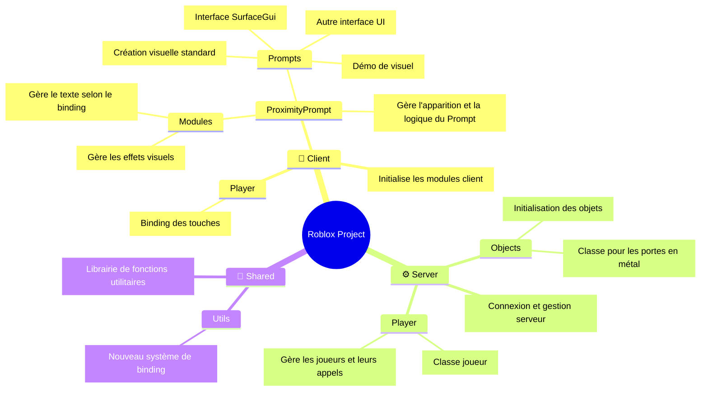
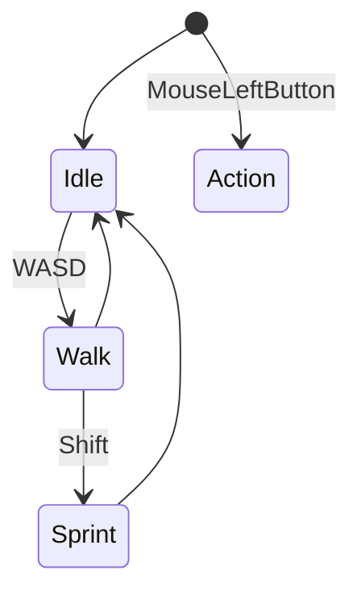

# 🧩 Fiche technique — _Lost Signal DEMO_

## 🎮 **Composantes de gameplay**

| Composante          | Description                                                      | Implémentation                                 |
| ------------------- | ---------------------------------------------------------------- | ---------------------------------------------- |
| Déplacement de base | Mouvement standard Roblox `Humanoid`                             | Par défaut                                     |
| Accroupissement     | Toggle ou maintient (`ctrl` ou `C`) pour passer en mode accroupi | Animation + vitesse réduite                    |
| Sprint              | Sprint temporaire avec barre de stamina                          | `Shift` + système de recharge et effets visuel |
| Stamina             | Barre qui diminue en sprint, se recharge lentement               | UI + logique de cooldown                       |
| Lampe torche        | Toggle avec `F`, portée limitée, effet de lumière dynamique      | `SpotLight` attaché au joueur                  |
| Interaction         | Appuie sur une touche `E` pour interagir avec des objets         | `ProximityPrompt`                              |
| Journal/Logs        | Objets à ramasser ou lire                                        | UI                                             |
| Effets visuels      | Brouillard, lumières dynamiques, distorsion visuelle             | `PostEffect`, `Tween`, `ParticleEmitter`       |
| Effets sonores      | Bruits de pas, radio, ambiance et jumpscare                      | `SoundService` + `Sound` localisés             |
| Evènements scriptés | Apparitions, blackout, portes qui s'ouvrent toutes seules        | `BindableEvent`, `Tween`, `Animation`          |
| Fin de partie       | Déclenchement d'une fin (sortie, piégeage, révélation)           | Trigger + UI narrative                         |

## 🧱 **Structure technique du projet**

### 👤Client

- `Player/Inputs.luau`: 
	- Binding des touches
- `ProximityPrompt/Modules/PromptEffect.luau`: 
	- Gère la création et la suppression des effets des `ProximityPrompt`
- `ProximityPrompt/Modules/PromptText.luau`: 
	- Gère le visuel du texte afficher en fonction du binding
- `ProximityPrompt/Prompts/CustomPrompt1.luau`:
	- Module de démo pour créer un visuel
- `ProximityPrompt/Prompts/CustomPrompt2`:
	- Module de création de visuel pour `ProximityPrompt`
- `ProximityPrompt/Prompts/CustomPrompt3.luau`:
	- Pareille mais utilise un autre UI
- `ProximityPrompt/Prompts/CustomPrompt4.luau`:
	- Pareille mais utilise un `SurfaceGui`
- `ProximityPrompt/CustomPromptHandler.luau`:
	- Gère l'apparition du `ProximityPrompt` en fonction des paramètres qu'il contient
- `init.client.luau`:
	- Appelle les modules pour les initialiser

### ⚙️Server

- `Objects/InitObjects.luau`:
	- Appelle les objets créés et les initialise
- `Objects/MetalDoorClass.luau`:
	- Classe pour les portes en métal
- `Player/PlayerClass.luau`:
	- Classe pour les joueur
- `Player/PlayerManager.luau`:
	- Gère les joueurs et les appels
- `init.server.luau`:
	-  Gère la connexion des joueurs et du serveur

### 🔁 Shared

- `Utils/InputActions.luau`:
	- Module très puissant utilisant le nouveau type de binding
- `Utility.luau`:
	- Bibliothèque perso de fonctions très pratiques

## 🧠 **À prévoir côté scripting**

- **Gestion des inputs** : `UserInputService` pour `Shift`, `Ctrl`, `F`, `E`
- **État du joueur** : `isCrouching`, `isSprinting`, `stamina`, `hasFlashlight`
- **Effets dynamiques** : `TweenService`, `Lighting`, `SoundService`
- **Interactions** : `ProximityPrompt`, `ClickDetector`, ou système custom
- **Narration** : `ModuleScript` pour stocker les logs, dialogues, événements

### State Machine

--- 
##### *Credits to:* 
<a href="https://obsidian.md/" style="text-decoration: none; color: gold; margin-left: 10px;"> Obsidian </a> \
<a href="https://obsidian.md/" style="text-decoration: none; color: gold; margin-left: 10px;"> Mermaid </a>
